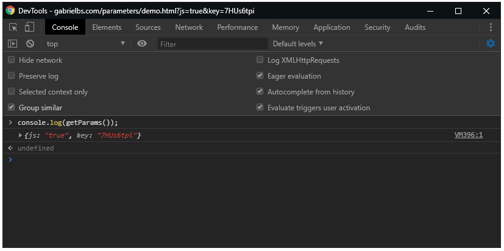

# Pegar a Query String com Javascript

```javascript
function getParams(){
    const paramsExtracted = location.search.substring(1).split("&");

    const params = {};

    for (const item of paramsExtracted) {
        if (item.trim() !== '') {
            let index = item.indexOf('=');

            if (index !== -1) {
                params[item.substring(0, index)] = item.substring(index + 1);
            } else {
                params[item] = null;
            }
        }
    }

    return params;
}
```

## Versão minificada (Minified version)
```javascript
function getParams(){const t=location.search.substring(1).split("&"),n={};for(const s of t)if(""!==s.trim()){let t=s.indexOf("=");-1!==t?n[s.substring(0,t)]=s.substring(t+1):n[s]=null}return n}
```

## Como usar (How to use)
```javascript
const params = getParams(); // Retorna um JSON
console.log(params);
```


